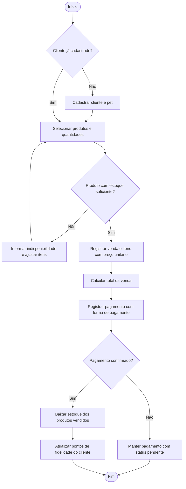
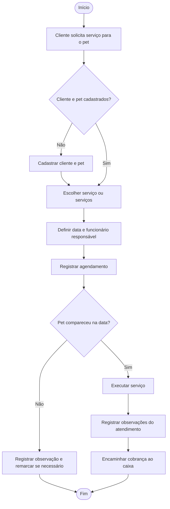
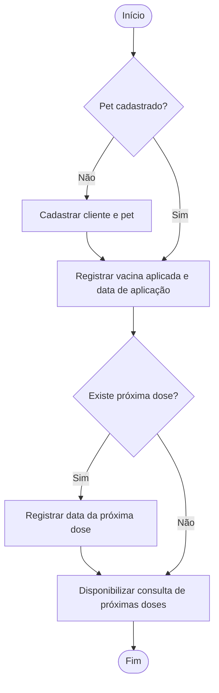
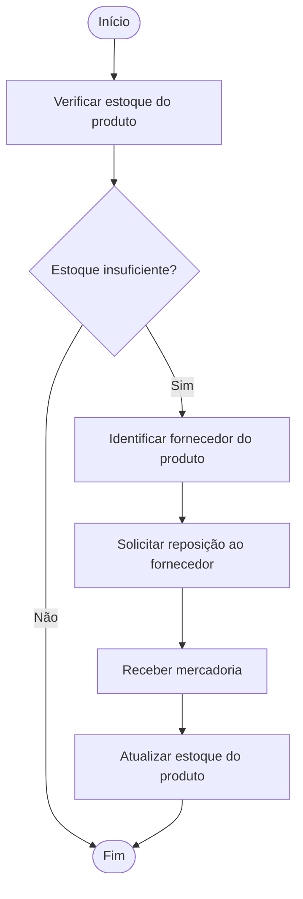

# Tati-Petshop

# Projeto ERP — Tati Peti Shop

> Primeira entrega — Projeto Integrador de Modelagem de Dados
> Do problema real ao Modelo Conceitual de Dados

---

## 1. Identificação da equipe

| Integrante | Papel / Contribuição |
|---|---|
| [preencher] | [preencher] |
| [preencher] | [preencher] |
| [preencher] | [preencher] |

---

## 2. Caracterização da empresa

**Nome:** Tati Peti Shop
**Segmento:** comércio varejista e prestação de serviços para animais de estimação (pet shop de pequeno porte).

**O que vende e oferece**
- **Produtos:** rações, acessórios, itens de higiene e demais artigos para pets, organizados por categorias.
- **Serviços:** serviços de cuidado e estética agendados com antecedência (como banho e tosa), executados por funcionários.
- **Acompanhamento de saúde:** registro do histórico de vacinas dos animais atendidos, com controle da data de aplicação e da próxima dose.
- **Fidelização:** programa de pontos para clientes cadastrados.

**Principais clientes:** tutores (donos) de animais de estimação, que compram produtos, agendam serviços para seus pets e esperam ser reconhecidos como clientes recorrentes.

**Principais setores**

| Setor | Responsabilidade |
|---|---|
| Atendimento / balcão | Cadastro de clientes e pets, atendimento e agendamentos |
| Vendas / caixa | Registro de vendas, itens, pagamentos e formas de pagamento |
| Estoque e compras | Controle de produtos, categorias, estoque e fornecedores |
| Serviços | Execução dos serviços agendados por funcionários responsáveis |
| Saúde do pet | Registro de vacinas e próximas doses |
| Fidelização | Acúmulo e atualização de pontos dos clientes |

**Como funciona atualmente (cenário considerado no projeto):** as informações da loja são registradas de forma dispersa, em planilhas, anotações e agenda em papel. O cadastro do cliente fica separado do cadastro do pet, o estoque é conferido manualmente, as vendas não atualizam o estoque automaticamente, o histórico de vacinas depende da memória do atendente ou de anotações soltas, e os pagamentos são registrados de forma separada das vendas. Isso dificulta acompanhar vendas, estoque, agenda e relacionamento com o cliente.

**Informações importantes para o negócio:** dados de clientes e pets; catálogo de produtos, preços, categorias e estoque; fornecedores; vendas e itens vendidos; pagamentos e formas de pagamento; serviços e agenda; histórico de vacinas; pontos de fidelidade.

---

## 3. Justificativa da escolha

O pet shop foi escolhido por reunir, em uma única empresa pequena, **vários processos que dependem uns dos outros**, o que o torna adequado para um projeto de modelagem de dados e para a aplicação de um sistema ERP:

- **Processos analisáveis e distintos:** venda de produtos, agendamento de serviços, controle de estoque, controle de pagamentos, acompanhamento de vacinas e fidelização.
- **Problemas reais de organização da informação:** dados duplicados entre planilhas, estoque desatualizado, agenda em papel e ausência de histórico consolidado do cliente e do pet.
- **Necessidade clara de integração:** uma venda impacta estoque, pagamento e pontos de fidelidade; um agendamento envolve cliente, pet, serviço e funcionário.
- **Riqueza de relacionamentos:** o modelo apresenta relações 1:N, N:N (resolvidas com entidade associativa) e informações que pertencem a relacionamentos (quantidade e preço unitário na venda), permitindo exercitar todas as etapas do manual.
- **Evolução natural:** o modelo pode crescer para compras junto a fornecedores, prontuário do pet, controle financeiro e emissão de relatórios.

---

## 4. Problemas identificados

| Nº | Problema | Consequência |
|---|---|---|
| P01 | Cadastro de clientes e pets em planilhas/anotações separadas | Duplicidade e dificuldade de saber quais pets pertencem a cada cliente |
| P02 | Controle manual de estoque | Erros na quantidade disponível; venda de produto sem estoque |
| P03 | Vendas não integradas ao estoque | Informações de estoque desatualizadas |
| P04 | Preços registrados sem histórico | Impossível saber por quanto um produto foi vendido em cada venda |
| P05 | Pagamentos anotados separadamente das vendas | Dificuldade de saber o que já foi pago, pendente ou como foi pago |
| P06 | Agenda de serviços em papel | Conflitos de horário, esquecimento de agendamentos e falta de responsável definido |
| P07 | Histórico de vacinas sem registro organizado | Perda de datas e esquecimento de próximas doses |
| P08 | Fornecedores sem vínculo com os produtos | Dificuldade de saber quem repor e onde comprar |
| P09 | Produtos sem categorização padronizada | Dificuldade de consulta e de relatórios por categoria |
| P10 | Pontos de fidelidade controlados manualmente | Erros, perda de pontos e clientes sem acompanhamento |
| P11 | Dificuldade de gerar relatórios | Pouca visibilidade de vendas, clientes e serviços |

**Necessidades:** centralizar cadastros; integrar venda, estoque, pagamento e fidelidade; organizar agenda e histórico de vacinas; vincular fornecedores e categorias aos produtos; permitir consultas e relatórios confiáveis.

---

## 5. Processos de negócio

| Processo | Quem participa | O que inicia | O que acontece | Informação gerada | Resultado |
|---|---|---|---|---|---|
| **1. Cadastro de cliente e pet** | Cliente, atendente | Chegada de um novo cliente | Registram-se os dados do cliente e de seus pets | Cliente, Pet | Cliente e pet aptos a comprar e agendar |
| **2. Venda de produtos** | Cliente, atendente/caixa | Cliente escolhe produtos | Verifica-se o estoque, registram-se a venda e os itens, calcula-se o total | Venda, Item de Venda | Venda registrada e pronta para pagamento |
| **3. Pagamento** | Cliente, caixa | Fechamento da venda | Registra-se um ou mais pagamentos com a forma utilizada e o status | Histórico de Pagamentos | Venda paga (ou pendente) |
| **4. Atualização de estoque** | Sistema, responsável pelo estoque | Venda confirmada ou recebimento de mercadoria | Baixa ou entrada de quantidades no produto | Estoque atualizado | Estoque confiável |
| **5. Fidelização** | Sistema, cliente | Compra concluída | Atualizam-se os pontos do cliente | Programa de Fidelidade | Pontos atualizados |
| **6. Agendamento e atendimento de serviço** | Cliente, pet, atendente, funcionário | Cliente solicita um serviço | Agenda-se o serviço com data, pet e funcionário responsável; no dia, o serviço é executado e as observações são registradas | Agendamento, Serviço | Serviço realizado e registrado |
| **7. Controle de vacinas** | Atendente, pet | Aplicação de vacina | Registram-se vacina, data de aplicação e próxima dose | Histórico de Vacinas | Histórico do pet atualizado |
| **8. Reposição de estoque** | Responsável pelo estoque, fornecedor | Estoque insuficiente | Identifica-se o fornecedor do produto e solicita-se a reposição | Produto, Fornecedor | Estoque reabastecido |

---

## 6. Requisitos funcionais

| Código | Requisito |
|---|---|
| RF01 | O sistema deverá cadastrar clientes (nome, telefone e e-mail). |
| RF02 | O sistema deverá cadastrar pets (nome, espécie e raça) vinculados a um cliente. |
| RF03 | O sistema deverá cadastrar categorias de produtos. |
| RF04 | O sistema deverá cadastrar produtos (nome, preço e estoque) associados a uma categoria e a um fornecedor. |
| RF05 | O sistema deverá cadastrar fornecedores (nome e contato). |
| RF06 | O sistema deverá cadastrar serviços (nome e preço). |
| RF07 | O sistema deverá cadastrar funcionários. |
| RF08 | O sistema deverá cadastrar formas de pagamento. |
| RF09 | O sistema deverá registrar vendas vinculadas a um cliente, com data e itens. |
| RF10 | O sistema deverá registrar, em cada item de venda, a quantidade e o preço unitário praticado. |
| RF11 | O sistema deverá calcular o total da venda a partir dos itens. |
| RF12 | O sistema deverá registrar pagamentos de uma venda, com data, valor, status e forma de pagamento. |
| RF13 | O sistema deverá atualizar o estoque dos produtos após a venda e na reposição. |
| RF14 | O sistema deverá registrar agendamentos de serviços para um pet, com data, observações, um ou mais serviços e um funcionário responsável. |
| RF15 | O sistema deverá registrar o histórico de vacinas do pet (vacina, data de aplicação e próxima dose). |
| RF16 | O sistema deverá permitir consultar as próximas doses de vacina dos pets. |
| RF17 | O sistema deverá acumular e atualizar os pontos do programa de fidelidade do cliente. |
| RF18 | O sistema deverá permitir consultar o histórico de compras e de agendamentos do cliente. |
| RF19 | O sistema deverá permitir consultar a agenda de serviços por data e por funcionário. |
| RF20 | O sistema deverá permitir consultar produtos por categoria e por fornecedor. |
| RF21 | O sistema deverá emitir relatórios de vendas e de pagamentos por período. |

---

## 7. Requisitos não funcionais

| Código | Requisito | Tipo |
|---|---|---|
| RNF01 | O sistema deverá controlar o acesso dos usuários por perfil (por exemplo, atendente, caixa e gerente). | Segurança |
| RNF02 | O sistema deverá manter registro das operações realizadas pelos usuários (quem fez, o quê e quando). | Segurança / rastreabilidade |
| RNF03 | O sistema deverá proteger os dados pessoais de clientes conforme a LGPD. | Segurança / privacidade |
| RNF04 | O sistema deverá apresentar consultas e cadastros em tempo adequado para uso no balcão. | Desempenho |
| RNF05 | O sistema deverá possuir interface simples, de modo que atendentes sem formação técnica consigam utilizá-lo. | Usabilidade |
| RNF06 | O sistema deverá evitar dados duplicados e manter a consistência entre vendas, itens, pagamentos e estoque. | Confiabilidade / integridade |
| RNF07 | O sistema deverá estar disponível durante o horário de funcionamento da loja. | Disponibilidade |
| RNF08 | O sistema deverá permitir cópias de segurança periódicas dos dados. | Confiabilidade |

---

## 8. Regras de negócio

| Código | Regra | Sustenta |
|---|---|---|
| RN01 | Cada produto pertence a exatamente uma categoria; uma categoria pode agrupar vários produtos e pode existir sem produtos. | *classifica* |
| RN02 | Cada produto é fornecido por um fornecedor; um fornecedor pode fornecer vários produtos e pode estar cadastrado sem produtos. | *fornece* |
| RN03 | Toda venda é realizada por um cliente cadastrado; um cliente pode realizar várias vendas ou nenhuma. | *realiza* |
| RN04 | Toda venda deve possuir pelo menos um item. | *possui itens* |
| RN05 | Cada item de venda pertence a exatamente uma venda e refere-se a exatamente um produto. | *possui itens*, *compõe* |
| RN06 | Um produto pode aparecer em vários itens de venda; um produto novo pode ainda não ter sido vendido. | *compõe* |
| RN07 | O item de venda registra a quantidade vendida e o preço unitário do produto **no momento da venda**, preservando o histórico mesmo que o preço do produto mude. | *Item de Venda* |
| RN08 | O total da venda corresponde à soma de (quantidade × preço unitário) dos seus itens. | *Venda* |
| RN09 | Uma venda pode ter vários pagamentos (por exemplo, parte em dinheiro e parte em cartão) ou nenhum enquanto estiver em aberto; cada pagamento pertence a uma única venda. | *registra pagamentos* |
| RN10 | Cada pagamento é feito por uma forma de pagamento; uma forma de pagamento pode ser usada em vários pagamentos. | *é usada em* |
| RN11 | Todo pagamento possui data, valor e status (por exemplo, pendente ou pago). | *Histórico de Pagamentos* |
| RN12 | Todo cliente possui pelo menos um pet cadastrado; cada pet pertence a um único cliente (tutor). | *possui* |
| RN13 | Um pet pode ter vários agendamentos ou nenhum; cada agendamento é feito para um único pet. | *recebe* |
| RN14 | Um agendamento solicita um ou mais serviços; um serviço pode ser solicitado em vários agendamentos ou em nenhum. | *é solicitado* |
| RN15 | Todo agendamento possui um funcionário responsável; um funcionário pode ser responsável por vários agendamentos. | *responsável por* |
| RN16 | Um pet pode ter vários registros de vacina ao longo do tempo; cada registro pertence a um único pet. | *possui histórico de vacinas* |
| RN17 | O registro de vacina informa a vacina, a data de aplicação e, quando houver, a data da próxima dose. | *Histórico de Vacinas* |
| RN18 | Um cliente pode participar do programa de fidelidade; cada registro de fidelidade pertence a um único cliente. | *acumula pontos* |
| RN19 | Os pontos do cliente são atualizados após compras concluídas e a data da última atualização é registrada. | *Programa de Fidelidade* |
| RN20 | O estoque de um produto não pode ficar negativo; não é permitido vender quantidade maior que a disponível. | *Produto*, *Item de Venda* |

---

## 9. Restrições e políticas organizacionais

| Código | Restrição / Política |
|---|---|
| RP01 | Apenas usuários autorizados (por exemplo, gerente) podem alterar preços de produtos e serviços e ajustar estoque manualmente. |
| RP02 | O cancelamento ou alteração de venda e pagamento deve ser feito por usuário autorizado e ficar registrado. |
| RP03 | O estoque somente é baixado quando a venda é finalizada. |
| RP04 | Todo cliente deve ser cadastrado antes de realizar uma venda, e não deve haver cadastros duplicados (verificação por telefone/e-mail). |
| RP05 | Somente clientes cadastrados acumulam pontos de fidelidade. |
| RP06 | Nenhum agendamento é confirmado sem pet, serviço e funcionário responsável definidos. |
| RP07 | Os dados pessoais dos clientes só podem ser acessados por usuários com perfil adequado (LGPD). |

---

## 10. Fluxogramas

### 10.1 Processo de venda, pagamento, estoque e fidelidade



### 10.2 Processo de agendamento e atendimento de serviço



### 10.3 Processo de controle de vacinas



### 10.4 Processo de reposição de estoque



**Integração entre os processos:** o cadastro de cliente e pet (Processo 1) alimenta vendas, agendamentos e vacinas; a venda (Processo 2) aciona o pagamento (3), a baixa de estoque (4) e os pontos de fidelidade (5); o estoque baixado por vendas dispara a reposição (8), que devolve quantidade ao produto; o agendamento (6) gera atendimento e cobrança no caixa.

---

## 11. Entidades

| Entidade | Por que existe (justificativa) | Requisitos / Regras |
|---|---|---|
| **Cliente** | Representa o tutor que compra e agenda serviços; é a base do relacionamento com a loja. | RF01, RF18 / RN03, RN12, RN18 |
| **Pet** | Animal atendido; serviços e vacinas são do pet, não do cliente. | RF02 / RN12, RN13, RN16 |
| **Categoria** | Padroniza o agrupamento de produtos e evita texto livre repetido. | RF03, RF20 / RN01 |
| **Produto** | Item vendido, com preço e estoque. | RF04, RF13 / RN01, RN02, RN20 |
| **Fornecedor** | Origem dos produtos; necessário para a reposição. | RF05 / RN02 |
| **Venda** | Operação de compra realizada por um cliente. | RF09, RF11 / RN03, RN04, RN08 |
| **Item de Venda** | Registra cada produto vendido, com quantidade e preço unitário; resolve a relação N:N entre Produto e Venda. | RF10 / RN05, RN06, RN07 |
| **Histórico de Pagamentos** | Registra cada pagamento de uma venda; permite vários pagamentos e status. | RF12 / RN09, RN11 |
| **Forma de Pagamento** | Padroniza os meios de pagamento aceitos. | RF08 / RN10 |
| **Serviço** | Serviço oferecido pela loja, com preço. | RF06 / RN14 |
| **Agendamento** | Reserva de um serviço para um pet em uma data. | RF14, RF19 / RN13, RN14, RN15 |
| **Funcionário** | Responsável pela execução do agendamento. | RF07 / RN15 |
| **Histórico de Vacinas** | Registra cada vacina aplicada ao pet e a próxima dose. | RF15, RF16 / RN16, RN17 |
| **Programa de Fidelidade** | Guarda os pontos acumulados pelo cliente. | RF17 / RN18, RN19 |

---

## 12. Atributos

| Entidade | Atributos |
|---|---|
| Cliente | id_cliente, nome, telefone, email |
| Pet | id_pet, nome, especie, raca |
| Categoria | id_categoria, nome |
| Produto | id_produto, nome, preco, estoque |
| Fornecedor | id_fornecedor, nome, contato |
| Venda | id_venda, data, total |
| Item de Venda | id_item_venda, quantidade, preco_unitario |
| Histórico de Pagamentos | id_pagamento, data, valor, status |
| Forma de Pagamento | id_forma_pagamento, nome |
| Serviço | id_servico, nome, preco |
| Agendamento | id_agendamento, data, observacoes |
| Funcionário | id_funcionario, nome |
| Histórico de Vacinas | id_vacina_pet, vacina, data_aplicacao, proxima_dose |
| Programa de Fidelidade | id_fidelidade, pontos, data_atualizacao |

> A categoria do produto é representada pelo **relacionamento** *classifica* com a entidade Categoria, e não como atributo de Produto, para evitar redundância.

---

## 13. Relacionamentos

| Nº | Relacionamento | Entidades | Situação de negócio |
|---|---|---|---|
| 1 | classifica | Categoria — Produto | A categoria classifica os produtos |
| 2 | fornece | Fornecedor — Produto | O fornecedor fornece produtos |
| 3 | realiza | Cliente — Venda | O cliente realiza vendas (compras) |
| 4 | possui itens | Venda — Item de Venda | A venda é composta por itens |
| 5 | compõe | Produto — Item de Venda | O produto compõe itens de venda |
| 6 | contém | Produto — Venda | A venda contém produtos (N:N resolvido por Item de Venda) |
| 7 | registra pagamentos | Venda — Histórico de Pagamentos | A venda é paga por meio de pagamentos |
| 8 | é usada em | Forma de Pagamento — Histórico de Pagamentos | A forma de pagamento é usada nos pagamentos |
| 9 | possui | Cliente — Pet | O cliente possui pets |
| 10 | recebe | Pet — Agendamento | O pet recebe atendimentos agendados |
| 11 | é solicitado | Agendamento — Serviço | O agendamento solicita serviços |
| 12 | responsável por | Funcionário — Agendamento | O funcionário é responsável por agendamentos |
| 13 | possui histórico de vacinas | Pet — Histórico de Vacinas | O pet possui registros de vacinas |
| 14 | acumula pontos | Cliente — Programa de Fidelidade | O cliente acumula pontos na fidelidade |

---

## 14. Cardinalidades

**Notação:** (mínimo, máximo) ao lado da entidade, indicando **quantas vezes uma ocorrência dela participa do relacionamento**, conforme o manual (ex.: CLIENTE (0,N) — REALIZA — VENDA (1,1)). Todas foram analisadas pelo método **vá e volte**.

| Relacionamento | Vá | Volta | Cardinalidade | Tipo |
|---|---|---|---|---|
| classifica | Uma categoria classifica quantos produtos? De 0 a N | Um produto pertence a quantas categorias? Exatamente 1 | Categoria (0,N) — Produto (1,1) | 1:N |
| fornece | Um fornecedor fornece quantos produtos? De 0 a N | Um produto tem quantos fornecedores? Exatamente 1 | Fornecedor (0,N) — Produto (1,1) | 1:N |
| realiza | Um cliente realiza quantas vendas? De 0 a N | Uma venda pertence a quantos clientes? Exatamente 1 | Cliente (0,N) — Venda (1,1) | 1:N |
| possui itens | Uma venda possui quantos itens? De 1 a N | Um item pertence a quantas vendas? Exatamente 1 | Venda (1,N) — Item de Venda (1,1) | 1:N |
| compõe | Um produto compõe quantos itens? De 0 a N | Um item refere-se a quantos produtos? Exatamente 1 | Produto (0,N) — Item de Venda (1,1) | 1:N |
| contém | Um produto consta em quantas vendas? De 0 a N | Uma venda contém quantos produtos? De 1 a N | Produto (0,N) — Venda (1,N) | N:N |
| registra pagamentos | Uma venda tem quantos pagamentos? De 0 a N | Um pagamento pertence a quantas vendas? Exatamente 1 | Venda (0,N) — Pagamento (1,1) | 1:N |
| é usada em | Uma forma de pagamento é usada em quantos pagamentos? De 0 a N | Um pagamento usa quantas formas? Exatamente 1 | Forma de Pagamento (0,N) — Pagamento (1,1) | 1:N |
| possui | Um cliente possui quantos pets? De 1 a N | Um pet pertence a quantos clientes? Exatamente 1 | Cliente (1,N) — Pet (1,1) | 1:N |
| recebe | Um pet recebe quantos agendamentos? De 0 a N | Um agendamento é de quantos pets? Exatamente 1 | Pet (0,N) — Agendamento (1,1) | 1:N |
| é solicitado | Um agendamento solicita quantos serviços? De 1 a N | Um serviço é solicitado em quantos agendamentos? De 0 a N | Agendamento (1,N) — Serviço (0,N) | N:N |
| responsável por | Um funcionário é responsável por quantos agendamentos? De 0 a N | Um agendamento tem quantos responsáveis? Exatamente 1 | Funcionário (0,N) — Agendamento (1,1) | 1:N |
| possui histórico de vacinas | Um pet tem quantos registros de vacina? De 0 a N | Um registro pertence a quantos pets? Exatamente 1 | Pet (0,N) — Histórico de Vacinas (1,1) | 1:N |
| acumula pontos | Um cliente tem quantos registros de fidelidade? De 0 a 1 | Um registro pertence a quantos clientes? Exatamente 1 | Cliente (0,1) — Programa de Fidelidade (1,1) | 1:1 |

**Relacionamentos N:N verificados:** *contém* (Produto — Venda) e *é solicitado* (Agendamento — Serviço).

**Atributos de relacionamentos analisados**

| Relacionamento N:N | Possui atributos próprios? | Decisão |
|---|---|---|
| contém (Produto — Venda) | **Sim:** quantidade e preço unitário, que descrevem a presença de um produto em uma venda específica | Materializados na entidade associativa **Item de Venda** |
| é solicitado (Agendamento — Serviço) | Não foram identificados atributos próprios nesta etapa | Mantido como N:N; poderá receber atributos (por exemplo, valor cobrado) e ser transformado em entidade associativa nas próximas etapas |

Os demais relacionamentos (1:N e 1:1) não possuem informações próprias: os dados envolvidos descrevem apenas uma das entidades.

---

## 15. Dicionário de dados conceitual

**Classificação dos atributos:** *Identificador* (identifica de forma única), *Simples* (informação básica), *Derivado* (calculado a partir de outros) e *Opcional* (pode não ser informado).

### Cliente

| Atributo | Descrição | Classificação | Regra / Observação |
|---|---|---|---|
| id_cliente | Identificador do cliente | Identificador | Identificação única |
| nome | Nome completo do cliente | Simples | Obrigatório |
| telefone | Telefone de contato | Simples | Obrigatório; não deve ser duplicado entre clientes (RP04) |
| email | E-mail de contato | Opcional | Não deve ser duplicado quando informado |

### Pet

| Atributo | Descrição | Classificação | Regra / Observação |
|---|---|---|---|
| id_pet | Identificador do pet | Identificador | Identificação única |
| nome | Nome do animal | Simples | Obrigatório |
| especie | Espécie do animal (ex.: cão, gato) | Simples | Obrigatório |
| raca | Raça do animal | Opcional | Pode ser desconhecida (sem raça definida) |

### Categoria

| Atributo | Descrição | Classificação | Regra / Observação |
|---|---|---|---|
| id_categoria | Identificador da categoria | Identificador | Identificação única |
| nome | Nome da categoria (ex.: rações, acessórios) | Simples | Obrigatório; não deve ser duplicado |

### Produto

| Atributo | Descrição | Classificação | Regra / Observação |
|---|---|---|---|
| id_produto | Identificador do produto | Identificador | Identificação única |
| nome | Nome do produto | Simples | Obrigatório |
| preco | Preço atual de venda | Simples | Obrigatório; maior que zero; alterado somente por usuário autorizado (RP01) |
| estoque | Quantidade disponível | Simples | Não pode ser negativo (RN20); atualizado por vendas e reposição |

### Fornecedor

| Atributo | Descrição | Classificação | Regra / Observação |
|---|---|---|---|
| id_fornecedor | Identificador do fornecedor | Identificador | Identificação única |
| nome | Nome do fornecedor | Simples | Obrigatório |
| contato | Dados para contato (telefone ou e-mail) | Simples | Necessário para solicitar reposição |

### Venda

| Atributo | Descrição | Classificação | Regra / Observação |
|---|---|---|---|
| id_venda | Identificador da venda | Identificador | Identificação única |
| data | Data em que a venda foi realizada | Simples | Obrigatório |
| total | Valor total da venda | Derivado | Soma de (quantidade × preco_unitario) dos itens (RN08); armazenado para consulta e histórico |

### Item de Venda

| Atributo | Descrição | Classificação | Regra / Observação |
|---|---|---|---|
| id_item_venda | Identificador do item | Identificador | Identificação única |
| quantidade | Quantidade do produto vendida | Simples | Obrigatório; maior que zero; limitada ao estoque (RN20) |
| preco_unitario | Preço do produto no momento da venda | Simples | Preserva o histórico de preços (RN07) |

### Histórico de Pagamentos

| Atributo | Descrição | Classificação | Regra / Observação |
|---|---|---|---|
| id_pagamento | Identificador do pagamento | Identificador | Identificação única |
| data | Data do pagamento | Simples | Obrigatório |
| valor | Valor pago | Simples | Maior que zero; a soma dos pagamentos de uma venda não deve superar o total |
| status | Situação do pagamento (ex.: pendente, pago) | Simples | Obrigatório (RN11) |

### Forma de Pagamento

| Atributo | Descrição | Classificação | Regra / Observação |
|---|---|---|---|
| id_forma_pagamento | Identificador da forma de pagamento | Identificador | Identificação única |
| nome | Nome da forma (ex.: dinheiro, cartão, Pix) | Simples | Obrigatório; não deve ser duplicado |

### Serviço

| Atributo | Descrição | Classificação | Regra / Observação |
|---|---|---|---|
| id_servico | Identificador do serviço | Identificador | Identificação única |
| nome | Nome do serviço (ex.: banho, tosa) | Simples | Obrigatório |
| preco | Preço do serviço | Simples | Obrigatório; alterado somente por usuário autorizado (RP01) |

### Agendamento

| Atributo | Descrição | Classificação | Regra / Observação |
|---|---|---|---|
| id_agendamento | Identificador do agendamento | Identificador | Identificação única |
| data | Data do atendimento agendado | Simples | Obrigatório |
| observacoes | Observações sobre o pet ou o atendimento | Opcional | Texto livre |

### Funcionário

| Atributo | Descrição | Classificação | Regra / Observação |
|---|---|---|---|
| id_funcionario | Identificador do funcionário | Identificador | Identificação única |
| nome | Nome do funcionário | Simples | Obrigatório |

### Histórico de Vacinas

| Atributo | Descrição | Classificação | Regra / Observação |
|---|---|---|---|
| id_vacina_pet | Identificador do registro de vacina | Identificador | Identificação única |
| vacina | Nome da vacina aplicada | Simples | Obrigatório |
| data_aplicacao | Data em que a vacina foi aplicada | Simples | Obrigatório |
| proxima_dose | Data prevista para a próxima dose | Opcional | Informada somente quando houver reforço (RN17) |

### Programa de Fidelidade

| Atributo | Descrição | Classificação | Regra / Observação |
|---|---|---|---|
| id_fidelidade | Identificador do registro de fidelidade | Identificador | Identificação única |
| pontos | Pontos acumulados pelo cliente | Simples | Não pode ser negativo |
| data_atualizacao | Data da última atualização dos pontos | Simples | Atualizada a cada alteração de pontos (RN19) |

---

## 16. DER


O DER representa as **14 entidades**, seus atributos, os **14 relacionamentos** e as cardinalidades descritas nas seções 11 a 14. Ele é consequência direta dos requisitos e das regras de negócio, conforme a rastreabilidade abaixo.

| Problema | Requisitos | Regras | Entidades / Relacionamentos no DER |
|---|---|---|---|
| P01 | RF01, RF02 | RN03, RN12 | Cliente, Pet, *possui* |
| P02, P03 | RF04, RF13 | RN20, RP03 | Produto, Item de Venda, *compõe* |
| P04 | RF10 | RN07 | Item de Venda (preco_unitario) |
| P05 | RF08, RF12 | RN09, RN10, RN11 | Histórico de Pagamentos, Forma de Pagamento, *registra pagamentos*, *é usada em* |
| P06 | RF14, RF19 | RN13, RN14, RN15 | Agendamento, Serviço, Funcionário, *recebe*, *é solicitado*, *responsável por* |
| P07 | RF15, RF16 | RN16, RN17 | Histórico de Vacinas, *possui histórico de vacinas* |
| P08 | RF05, RF20 | RN02 | Fornecedor, *fornece* |
| P09 | RF03, RF20 | RN01 | Categoria, *classifica* |
| P10 | RF17 | RN18, RN19 | Programa de Fidelidade, *acumula pontos* |
| P11 | RF18, RF21 | RN03, RN08 | Cliente, Venda, *realiza*, *possui itens* |

---

## 17. Justificativas técnicas

**J01 — Item de Venda como entidade associativa.** Produto e Venda têm relação N:N (*contém*): um produto aparece em várias vendas e uma venda contém vários produtos. Como a relação possui informações próprias — quantidade e preço unitário —, elas foram levadas para a entidade **Item de Venda** (RN05 a RN07), ligada a Venda por *possui itens* e a Produto por *compõe*.

**J02 — Preço unitário no item e não apenas no produto.** O preço do produto pode mudar; guardar o preço praticado no item preserva o histórico de cada venda (P04, RN07).

**J03 — Cardinalidade Venda (1,N) — Item de Venda (1,1).** Foi definida porque a regra RN04 exige pelo menos um item por venda e cada item pertence a uma única venda.

**J04 — Cardinalidade Cliente (0,N) — Venda (1,1).** Um cliente cadastrado pode ainda não ter comprado nada, por isso 0,N; toda venda pertence a um único cliente (RN03, RP04).

**J05 — Histórico de Pagamentos separado de Venda.** Uma venda pode ser paga em partes ou ficar pendente (RN09), o que exige vários registros com data, valor e status. Por isso Venda tem cardinalidade (0,N) e cada pagamento (1,1).

**J06 — Forma de Pagamento como entidade.** Padroniza os meios de pagamento, evita textos digitados de formas diferentes e permite incluir novas formas sem alterar a estrutura (RN10).

**J07 — Categoria como entidade.** Uma categoria agrupa vários produtos e sua existência independe deles (0,N). Cada produto pertence a exatamente uma categoria (1,1), o que permite consultas e relatórios por categoria (RN01, RF20). Por isso a categoria não é atributo de Produto.

**J08 — Fornecedor (0,N) — Produto (1,1).** Adotou-se um fornecedor principal por produto para simplificar o controle de reposição (RN02, P08). Caso a loja passe a comprar o mesmo produto de vários fornecedores, o relacionamento evolui para N:N com entidade associativa.

**J09 — Cliente (1,N) — Pet (1,1).** O pet pertence a um único tutor, e o cliente é cadastrado porque possui ao menos um animal atendido pela loja (RN12). Serviços e vacinas estão ligados ao pet, e não ao cliente, pois são características do animal.

**J10 — Agendamento e Serviço como N:N.** Um agendamento pode reunir mais de um serviço (por exemplo, banho e tosa) e um serviço é solicitado em muitos agendamentos (RN14). Não foram identificados atributos próprios do relacionamento nesta etapa.

**J11 — Funcionário (0,N) — Agendamento (1,1).** Cada agendamento tem um único responsável, para que não haja atendimentos sem dono (RN15, RP06). Um funcionário pode ter vários agendamentos, ou nenhum.

**J12 — Histórico de Vacinas como entidade.** O pet recebe várias vacinas ao longo da vida, e cada uma tem sua data e possível reforço. Por isso não é atributo de Pet, mas uma entidade com cardinalidade (0,N) — (1,1) (RN16, RN17).

**J13 — Programa de Fidelidade 1:1 com Cliente.** O registro guarda o saldo atual e a data da última atualização, portanto há no máximo um por cliente; a adesão é opcional (0,1) e todo registro pertence a um cliente (1,1) (RN18, RN19, RP05).

**J14 — Atributo derivado *total*.** O total da venda pode ser calculado a partir dos itens, mas é mantido na entidade para facilitar consultas e preservar o valor registrado (RN08).

**J15 — Preparação para evolução.** O modelo foi construído para ser transformado em modelo lógico sem retrabalho: os identificadores estão definidos, os N:N foram tratados ou identificados, e há pontos de crescimento previstos, como ligar a cobrança de serviços aos pagamentos, registrar compras junto a fornecedores, associar o funcionário à venda realizada e permitir vários fornecedores por produto.

---

## 18. Conclusão

A primeira entrega transformou o cenário do Tati Peti Shop — cadastros dispersos, estoque manual, agenda em papel e ausência de histórico — em um modelo conceitual coerente. Partindo dos processos e problemas, foram levantados requisitos e regras de negócio, e deles derivados entidades, atributos, relacionamentos e cardinalidades, todos justificados. O DER integra vendas, estoque, pagamentos, fidelidade, agenda de serviços e histórico de vacinas, e constitui a base para as próximas etapas: **modelo lógico, normalização, modelo físico e banco de dados**.

---

### Organização do repositório

```
/
├── README.md
└── docs/
    └── der_conceitual.png
```